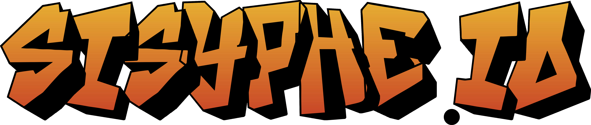

# Sisyphe.io

[](https://sisyphe.acciaw.me)

[](https://www.gnu.org/licenses/quick-guide-gplv3.html)
[](https://creativecommons.org/licenses/by-sa/4.0/?ref=chooser-v1)
[](https://www.python.org/)
[]()

> Other languages: [Español](README.es.md) · [العربية](README.ar.md) · [한국어](README.kr.md)
> *(translations cover the original text; the setup steps below are the current, cross-platform ones.)*

Sisyphe.io is a **final-year NSI (Digital and Computer Science) project**, winner of the 2024 NSI Trophies at the academic level, created and successfully developed by Killian MILANI, Siméon GILLET, Kylian ROUSSEAU, and Arthur BARBEROUSSE.

A complete **version-by-version changelog** of the project up to the release is available in [doc_nsi_old/changelog.txt](doc_nsi_old/changelog.txt).

> 📝 Following the conclusion of the 2024 NSI Trophies, the project documentation was updated to clarify the real involvement of each team member. You may notice differences between the documentation on [the competition website](https://trophees-nsi.fr/resultats-2024) and that on this GitHub repository.

## Summary

The game immerses you in a parallel Greek mythology, where the punishment imposed by the gods on Sisyphus is to wander an infinite labyrinth, searching for rocks to push into holes scattered across the terrain. The gameplay is inspired by the *Sokoban* concept but introduces numerous **original mechanics**, which you can explore across **5 unique worlds** — plus a complete, user-friendly **level editor**!

## Presentation and Demonstration

Click [here](https://youtu.be/KAzV44CmPmg) to watch the presentation and demonstration video.

> 📝 This presentation is also available on the PeerTube instance [Tube Sciences & Technologies](https://tube-sciences-technologies.apps.education.fr/).

> 💡 Prefer not to install anything? Visit the **dedicated website** at https://sisyphe.acciaw.me/ from your computer or smartphone, where a prebuilt Windows download is also available.

---

## Requirements

- **Python 3.10 – 3.14** (3.13 recommended — see the note on pygame below).
- **Tkinter** — the game's GUI. It ships with the official [python.org](https://www.python.org/downloads/) installers, but some distributions package it separately (see per-platform notes).
- Third-party packages (installed via `requirements.txt`): **Pillow** (textures) and **pygame** (audio).

> 🧩 **About pygame:** upstream `pygame` has wheels up to Python 3.13. On **Python 3.14** there is no upstream wheel yet, so `requirements.txt` automatically installs **`pygame-ce`** instead — the actively-maintained community fork that imports as `pygame` with the same API. If you want the upstream `pygame`, use Python ≤ 3.13.

> 🔤 **Fonts:** the UI font ships with the game — any `.ttf`/`.otf` in [assets/fonts/](assets/fonts/) (currently **Tiny5**) is registered at startup and used on every platform, with no system install. Replace that file to change the font everywhere. See [assets/package/fonts.py](assets/package/fonts.py).

## Installation

The project runs the same way on **Windows, macOS and Linux**. The recommended setup uses a virtual environment.

```bash
# 1. Get the code
git clone https://github.com/<your-account>/sisyphe.io.git
cd sisyphe.io

# 2. Create and activate a virtual environment
python3 -m venv .venv
source .venv/bin/activate        # Windows: .venv\Scripts\activate

# 3. Install the dependencies
python -m pip install -r requirements.txt
```

**Platform notes for Tkinter:**

- **Windows** — bundled with the official Python installer (make sure "tcl/tk and IDLE" is checked).
- **macOS** — use the [python.org](https://www.python.org/downloads/) build (Tk included). If you use **Homebrew** Python, install Tk separately: `brew install python-tk@3.13`.
- **Linux (Debian/Ubuntu)** — `sudo apt install python3-tk`.

## Running the game

From the project root, with the virtual environment active:

```bash
python app.py          # launch the game
python assets/editor.py  # (optional) launch the level editor directly
```

You normally don't need to run the editor yourself — it opens from the **Editor** button in the main menu (unlocked after finishing World 1).

### In VSCode

A workspace configuration is included in [.vscode/](.vscode):

- Open the folder in VSCode and select the **`.venv`** interpreter if prompted (it's set as the default).
- Press the **Run ▶ button** on `app.py`, or use **Run and Debug** → *"Sisyphe.io (game)"* / *"Sisyphe.io (level editor)"*.

> ⚠️ The most common "it won't run" cause is VSCode using a different interpreter than the one with the dependencies. Pick the project's `.venv` (bottom-right status bar → *Select Interpreter*).

## Usage and Controls

The main menu opens with the **Open** and **Editor** buttons grayed out. Finish all of **World 1** to unlock them. On first launch, a `Sisyphe.io` folder is created in your user data directory (see below) to store `settings.json` (progress + preferences) and `scores.db`.


- **Move:** Up / Right / Down / Left (default: arrow keys).
- **Interact** (rope, hammer, ...): default `E`.
- **Restart level:** default `R`.
- **Return to menu:** default `M`.
- Hold **Shift / Ctrl** to turn in place without moving.
- **F1** toggles **fullscreen** — the whole game scales up crisply (no blur,
  gameplay grid unchanged), and the 4:3 board's side bars are filled with tiled
  wall texture.

All keys are rebindable in the **Settings** menu, along with language (12 available), music/SFX volume and FPS. Position yourself behind a rock and push it into a hole to progress; each world introduces new mechanics with a short tutorial.

> 💡 Stuck on a level? [Here is a playlist of solutions for every world.](https://www.youtube.com/playlist?list=PLz5sgljMEZUJnqgS3YWLVvqHC81V0VvMx) Every level (and bonus level) is fully completable.

## Level editor

The **Editor** button on the home screen opens the editor **in the same window**, with an **in-window toolbar overlay** (top strip: Back / New / Open / Save / Save As / texture+audio toggles; bottom strip: the block tools as icons, active one highlighted). It lets you build and save your own levels as `.json` files, then load them via the menu's **Open** button. Pick a block (toolbar or keyboard shortcut), click the grid to place it, and Save. A level must contain a player, at least as many rocks as holes, and matching portal/door pairs to be saved. All the original keyboard shortcuts still work.

The editor can also be launched on its own with `python assets/editor.py` (a standalone window with a classic menu bar) — handy for debugging.

## Save data location

Settings and scores are stored per-user, in the platform's standard location:

| OS | Path |
|----|------|
| Windows | `%LOCALAPPDATA%\Sisyphe.io\` |
| macOS | `~/Library/Application Support/Sisyphe.io/` |
| Linux | `$XDG_DATA_HOME/Sisyphe.io/` or `~/.local/share/Sisyphe.io/` |

To reset your save (progress, settings and scores), run [assets/del_save.py](assets/del_save.py):

```bash
python assets/del_save.py
```

## Project architecture

The game was originally a single large file; it is now split into small, focused modules.

```
sisyphe.io/
├─ app.py                     # thin launcher (builds the window, wires state, starts the loop)
├─ requirements.txt
├─ assets/
│  ├─ editor.py               # thin launcher for the level editor
│  ├─ del_save.py             # reset save data
│  ├─ settings.json           # default settings (copied to the user data dir on first run)
│  ├─ img/ · mus/ · sfx/      # textures, music, sound effects
│  ├─ niveaux/                # the official world levels (JSON)
│  └─ package/                # all game code
│     ├─ context.py           # shared runtime state (window, board, managers, flags)
│     ├─ paths.py             # cross-platform asset / user-data paths
│     ├─ platform_utils.py    # cross-platform icon, cursor, open-URL helpers
│     ├─ settings.py          # load/save settings.json
│     ├─ board.py             # board, level loading, win test, entity lookups
│     ├─ render.py            # canvas drawing + HUD + refresh loop
│     ├─ movement.py          # the keyboard / movement engine
│     ├─ level_flow.py        # level transitions, end screens, hint timers
│     ├─ images.py · db.py · tooltip.py · game_state.py
│     ├─ audio/               # music.py + sounds.py
│     ├─ lang/                # one module per language + catalog.py
│     └─ ui/                  # main_menu, world_select, settings_menu, credits, dialogs, intro, widgets
│     └─ editor/              # the level editor (context, tools, placement, render, files, menu, overlay, embed, app)
└─ test_levels/               # sample custom levels
```

**Design notes for contributors:** shared mutable state lives in `context.py` (one for the game, one for the editor), so screens read/write `context.X`. The editor normally runs **embedded** in the game window (`editor/embed.py` points the editor context at the game's window/canvas); it can also run standalone via `assets/editor.py`. To keep imports cycle-free, modules import each other as modules (`from . import x` then `x.func()`), never `from .x import func`. The same package is imported as `assets.package.*` by the game and as `package.*` by the standalone editor, so all intra-package imports are relative.

## Building a standalone executable

The game can be bundled with [PyInstaller](https://pyinstaller.org/) (`pip install pyinstaller`). Set `fichier_exe = True` in `app.py` first, then see [exe.txt](exe.txt) for the exact build commands (they use `--add-data "assets;assets"` to bundle the assets).

## Dependencies

Standard library: `tkinter` (+ `ttk`), `time`, `json`, `sys`, `os`, `shutil`, `sqlite3`, `datetime`, `platform`, `webbrowser`, `ctypes` (font registration).

Third-party (`requirements.txt`):
- **Pillow** — loading and scaling game textures.
- **pygame** (or **pygame-ce** on Python 3.14) — music and sound effects.

## Sources

- All music is sourced from the game [Undertale Yellow](https://gamejolt.com/games/UndertaleYellow/136925):
   - Menu: [OST: 051 - Feisty!](https://youtu.be/hvl1GqD-Vis)
   - World selection: [OST: 056 - The Stable](https://youtu.be/owAVwJ5-EaE)
   - Settings: [OST: 053 - Happy Hour](https://youtu.be/T0IRbP1Z2pI?si=fZkLpd8WWcjTBq68)
   - Editor: [OST: 081 - Build-A-Bot](https://youtu.be/ut-_p-P9lsI)
   - World 1: [OST: 012 - Seclusion](https://youtu.be/CinLLgjqUqI)
   - World 2: [OST: 037 - Mining Co](https://youtu.be/wJVubgGxUwI)
   - World 3: [OST: 055 - The Wild East](https://youtu.be/5Q6Ss9uoQhE)
   - World 4: [OST: 035 - Vigorous Terrain](https://youtu.be/PuHE_GRzT5Q)
   - World 5: [OST: 070 - Showdown!](https://youtu.be/b4Z_GFpXScI)
   - Credits (unused): [OST: 067 - Deal 'Em Out](https://www.youtube.com/watch?v=IetJ8URgg5c)
- All game sounds come from [freesound.org](https://freesound.org/) under the **Creative Commons Zero license**.
- The main character was made using the [Universal-LPC-Spritesheet-Character-Generator](https://sanderfrenken.github.io/Universal-LPC-Spritesheet-Character-Generator).
- The illustrations (logos/menus) were made by **Arthur BARBEROUSSE**, a high-school student at Edmond Perrier High School in their final year during the 2023–2024 academic year.
- Website images:
   - pierre.png : [Inspired by Sahil Bhardwaj (Kudo Artist)](https://www.artstation.com/artwork/L2grNw) on Artstation
   - porte.png : [Image by SY-37](https://www.artstation.com/artwork/RzzWW) on Artstation
   - tour.png : [Image by upklyak](https://www.freepik.com/free-vector/magic-vector-staff-wizard-game-fantasy-stick_40511664.htm) on Freepik
   - rock.png / volcan.png / lava.png : [Images by upklyak](https://www.freepik.com/free-vector/floating-islands-rocky-land-with-lava-eruption_137539464.htm) on Freepik
   - font : [Minecraft Font by JDGraphics](https://www.fontspace.com/minecraft-font-f28180) on FontSpace

## Licenses

**Sokoban License:**

Sokoban® & © 1982 Thinking Rabbit Co., Ltd.
Sokoban logo, Sokoban theme song, and Sokoban mechanics are trademarks of Thinking Rabbit Co., Ltd.
Licensed to Unbalance Co., Ltd. Game Design by Hiroyuki Imabayashi. All Rights Reserved.

---

**Undertale Yellow License:**

Undertale Yellow is a free fan project based on Undertale by Toby Fox and Temmie Chang.
Undertale Yellow soundtrack composed by MasterSwordRemix, Noteblock, MyNewSoundtrack, and Figburn.

---

**Sisyphe.io License:**

For more information about the licensing of this project, please refer to the badges at the very top of this document — click a badge to be redirected to the official license description.
